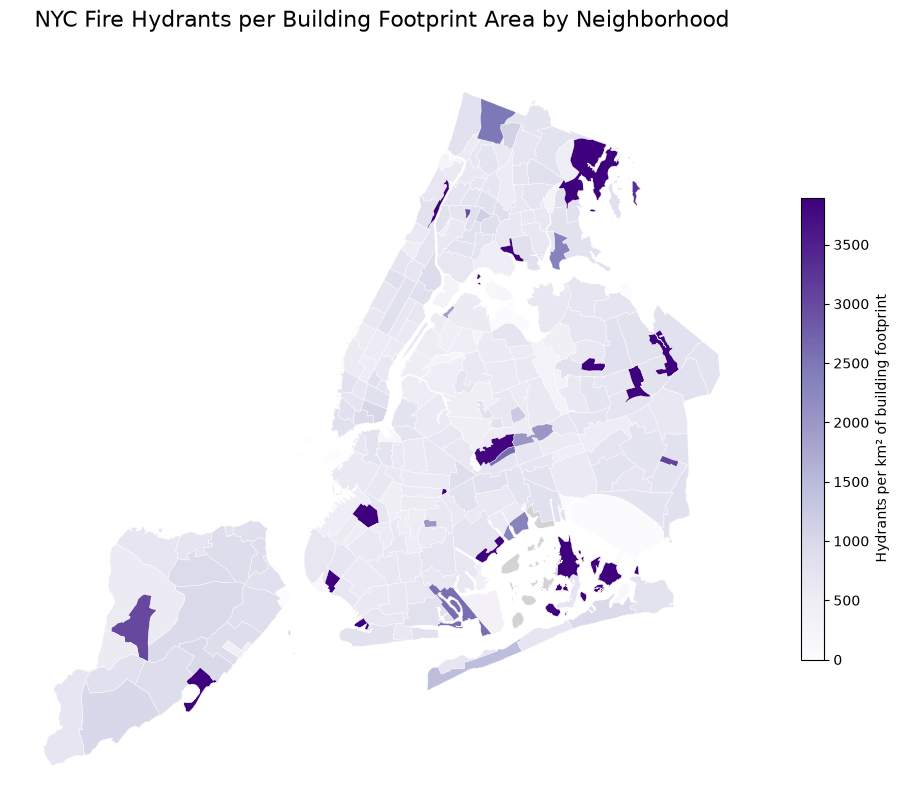
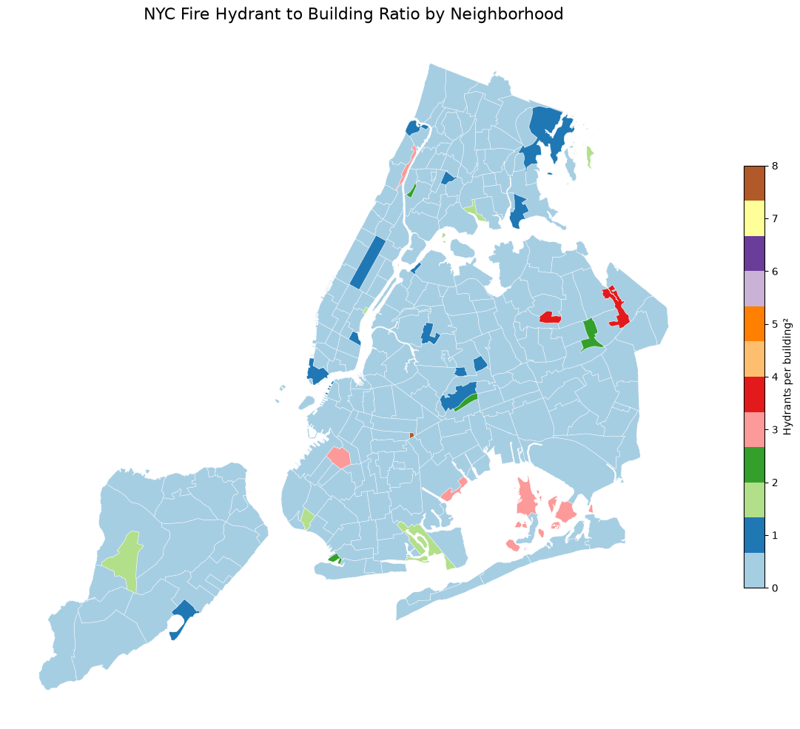
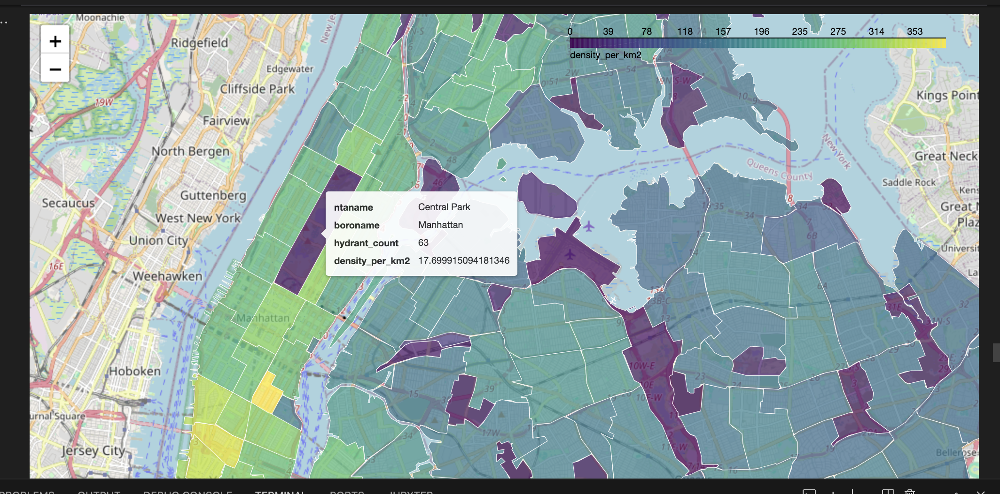
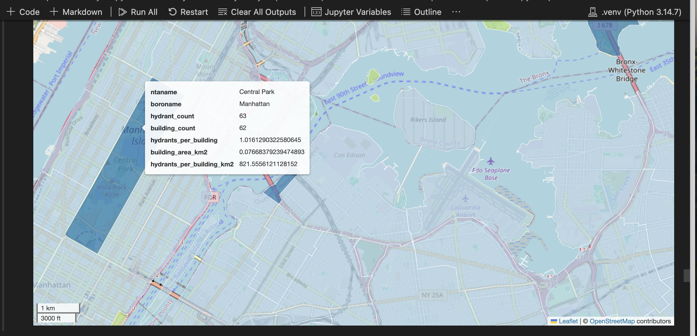
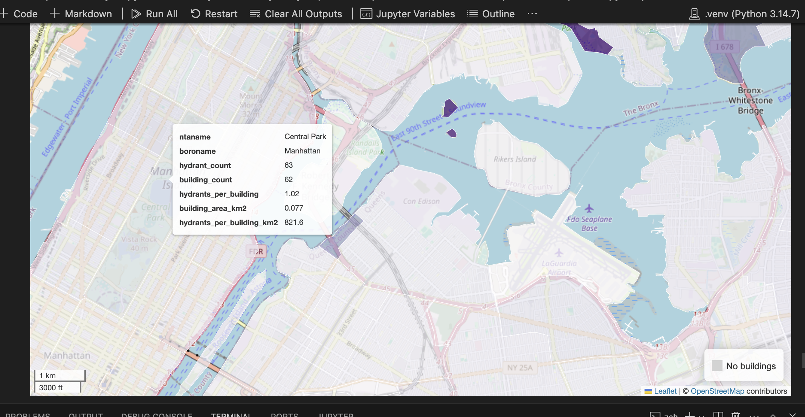

# NYC Hydrant Density Analysis

## The question

Where is hydrant coverage densest in NYC, and which neighborhoods are underserved relative to their area?

## The data

- **NYC Neighborhoods.** 262 polygons (Source: [NYC Open Data](https://opendata.cityofnewyork.us))
- **NYC Fire Hydrants.** 109,725 points (Source: [NYC Open Data](https://opendata.cityofnewyork.us))
- **NYC Buidling Footprints.** 1,083,062 polygons (Source: [NYC Open Data](https://opendata.cityofnewyork.us))
- License: NYC Open Data Terms of Use
- All data in EPSG:4326

## Methodology

Built two analyses: 

- **SQL (PostGIS).** I started with five progressive queries in `analysis.sql`, going from simple filter to spatial join to area-normalized density to 100m-buffer coverage analysis.This helped establsihed the base logic for my work. 

- **Python (GeoPandas).** My in-depth analysis is in `analysis.ipynb`, which also has static choropleth and interactive `.explore()` maps. The final output exported to GeoParquet.

After recreating the intital 5 sql queries in python- i folded in additional analysis by gathering building footprint data from NYC's Open Data Portal. This helps better normalize our data. While understnading hydrant dnesity as a a function of a neigbhborhood's area is helpful, this is a simple approach. Realistically speaking, hydrant 'need' is more closely tied to developed area in a neighborhoodd. In the cotnext of city fires, highly devleoped land is more lilely to need access to hydrants than barren/undeveloped land. With this in mind. I calculated the total area of building footprints in each neighborhood, as well as the building count per neigbhoorhod. Then, I calculated the ratio of hydrants to building area and building count for each neighborhood. This helpful improve how the data is normalized.


## Findings

Neighborhoods with the most hydrants:
<div>

<table border="1" class="dataframe">
  <thead>
    <tr style="text-align: right;">
      <th></th>
      <th>hydrant_count</th>
    </tr>
    <tr>
      <th>ntaname</th>
      <th></th>
    </tr>
  </thead>
  <tbody>
    <tr>
      <th>Annadale-Huguenot-Prince's Bay-Woodrow</th>
      <td>1708</td>
    </tr>
    <tr>
      <th>Great Kills-Eltingville</th>
      <td>1672</td>
    </tr>
    <tr>
      <th>Todt Hill-Emerson Hill-Lighthouse Hill-Manor Heights</th>
      <td>1282</td>
    </tr>
    <tr>
      <th>Sheepshead Bay-Manhattan Beach-Gerritsen Beach</th>
      <td>1187</td>
    </tr>
    <tr>
      <th>Canarsie</th>
      <td>1155</td>
    </tr>
    <tr>
      <th>Westerleigh-Castleton Corners</th>
      <td>1137</td>
    </tr>
    <tr>
      <th>New Springville-Willowbrook-Bulls Head-Travis</th>
      <td>1111</td>
    </tr>
    <tr>
      <th>West New Brighton-Silver Lake-Grymes Hill</th>
      <td>1103</td>
    </tr>
    <tr>
      <th>Bay Ridge</th>
      <td>1096</td>
    </tr>
    <tr>
      <th>St. Albans</th>
      <td>1086</td>
    </tr>
  </tbody>
</table>
</div>

Neighborhoods with the highest hydrant density (per km²):

<table border="1" class="dataframe">
  <thead>
    <tr style="text-align: right;">
      <th></th>
      <th>ntaname</th>
      <th>boroname</th>
      <th>hydrant_count</th>
      <th>area_km2</th>
      <th>density_per_km2</th>
    </tr>
  </thead>
  <tbody>
    <tr>
      <th>132</th>
      <td>Gramercy</td>
      <td>Manhattan</td>
      <td>269.0</td>
      <td>0.699188</td>
      <td>384.731873</td>
    </tr>
    <tr>
      <th>121</th>
      <td>SoHo-Little Italy-Hudson Square</td>
      <td>Manhattan</td>
      <td>432.0</td>
      <td>1.200006</td>
      <td>359.998077</td>
    </tr>
    <tr>
      <th>119</th>
      <td>Tribeca-Civic Center</td>
      <td>Manhattan</td>
      <td>433.0</td>
      <td>1.261461</td>
      <td>343.252757</td>
    </tr>
    <tr>
      <th>123</th>
      <td>West Village</td>
      <td>Manhattan</td>
      <td>447.0</td>
      <td>1.339370</td>
      <td>333.738876</td>
    </tr>
    <tr>
      <th>118</th>
      <td>Financial District-Battery Park City</td>
      <td>Manhattan</td>
      <td>570.0</td>
      <td>1.786223</td>
      <td>319.109090</td>
    </tr>
    <tr>
      <th>122</th>
      <td>Greenwich Village</td>
      <td>Manhattan</td>
      <td>304.0</td>
      <td>0.985044</td>
      <td>308.615677</td>
    </tr>
    <tr>
      <th>140</th>
      <td>Upper East Side-Carnegie Hill</td>
      <td>Manhattan</td>
      <td>565.0</td>
      <td>1.864133</td>
      <td>303.089907</td>
    </tr>
    <tr>
      <th>126</th>
      <td>East Village</td>
      <td>Manhattan</td>
      <td>522.0</td>
      <td>1.763311</td>
      <td>296.033997</td>
    </tr>
    <tr>
      <th>130</th>
      <td>Midtown-Times Square</td>
      <td>Manhattan</td>
      <td>669.0</td>
      <td>2.281006</td>
      <td>293.291673</td>
    </tr>
    <tr>
      <th>124</th>
      <td>Chinatown-Two Bridges</td>
      <td>Manhattan</td>
      <td>310.0</td>
      <td>1.072230</td>
      <td>289.117050</td>
    </tr>
  </tbody>
</table>
</div>

Neighborhoods with the highest hydrant to building ratio:

<table border="1" class="dataframe">
  <thead>
    <tr style="text-align: right;">
      <th></th>
      <th>ntaname</th>
      <th>boroname</th>
      <th>hydrant_count</th>
      <th>building_count</th>
      <th>hydrants_per_building</th>
      <th>building_area_km2</th>
      <th>hydrants_per_building_km2</th>
    </tr>
  </thead>
  <tbody>
    <tr>
      <th>28</th>
      <td>Lincoln Terrace Park</td>
      <td>Brooklyn</td>
      <td>8.0</td>
      <td>1.0</td>
      <td>8.000000</td>
      <td>0.000083</td>
      <td>96613.436219</td>
    </tr>
    <tr>
      <th>193</th>
      <td>Kissena Park</td>
      <td>Queens</td>
      <td>25.0</td>
      <td>7.0</td>
      <td>3.571429</td>
      <td>0.001029</td>
      <td>24291.799978</td>
    </tr>
    <tr>
      <th>214</th>
      <td>Alley Pond Park</td>
      <td>Queens</td>
      <td>48.0</td>
      <td>14.0</td>
      <td>3.428571</td>
      <td>0.005872</td>
      <td>8173.892615</td>
    </tr>
    <tr>
      <th>64</th>
      <td>Canarsie Park &amp; Pier</td>
      <td>Brooklyn</td>
      <td>19.0</td>
      <td>6.0</td>
      <td>3.166667</td>
      <td>0.001246</td>
      <td>15244.599057</td>
    </tr>
    <tr>
      <th>153</th>
      <td>Highbridge Park</td>
      <td>Manhattan</td>
      <td>32.0</td>
      <td>11.0</td>
      <td>2.909091</td>
      <td>0.004421</td>
      <td>7238.344956</td>
    </tr>
    <tr>
      <th>237</th>
      <td>Jamaica Bay (East)</td>
      <td>Queens</td>
      <td>22.0</td>
      <td>8.0</td>
      <td>2.750000</td>
      <td>0.001226</td>
      <td>17948.239260</td>
    </tr>
    <tr>
      <th>25</th>
      <td>Green-Wood Cemetery</td>
      <td>Brooklyn</td>
      <td>54.0</td>
      <td>20.0</td>
      <td>2.700000</td>
      <td>0.006219</td>
      <td>8683.640296</td>
    </tr>
    <tr>
      <th>200</th>
      <td>Cunningham Park</td>
      <td>Queens</td>
      <td>39.0</td>
      <td>16.0</td>
      <td>2.437500</td>
      <td>0.008358</td>
      <td>4666.367852</td>
    </tr>
    <tr>
      <th>81</th>
      <td>Yankee Stadium-Macombs Dam Park</td>
      <td>Bronx</td>
      <td>39.0</td>
      <td>16.0</td>
      <td>2.437500</td>
      <td>0.074800</td>
      <td>521.388823</td>
    </tr>
    <tr>
      <th>19</th>
      <td>Highland Park-Cypress Hills Cemeteries (South)</td>
      <td>Brooklyn</td>
      <td>27.0</td>
      <td>13.0</td>
      <td>2.076923</td>
      <td>0.010308</td>
      <td>2619.296986</td>
    </tr>
  </tbody>
</table>
</div>

Neighborhoods with the highest 100 ft hydrant buffer coverage:

<table border="1" class="dataframe">
  <thead>
    <tr style="text-align: right;">
      <th></th>
      <th>ntaname</th>
      <th>boroname</th>
      <th>covered_pct</th>
    </tr>
  </thead>
  <tbody>
    <tr>
      <th>121</th>
      <td>SoHo-Little Italy-Hudson Square</td>
      <td>Manhattan</td>
      <td>0.710126</td>
    </tr>
    <tr>
      <th>132</th>
      <td>Gramercy</td>
      <td>Manhattan</td>
      <td>0.675871</td>
    </tr>
    <tr>
      <th>123</th>
      <td>West Village</td>
      <td>Manhattan</td>
      <td>0.658189</td>
    </tr>
    <tr>
      <th>119</th>
      <td>Tribeca-Civic Center</td>
      <td>Manhattan</td>
      <td>0.656938</td>
    </tr>
    <tr>
      <th>140</th>
      <td>Upper East Side-Carnegie Hill</td>
      <td>Manhattan</td>
      <td>0.647572</td>
    </tr>
    <tr>
      <th>15</th>
      <td>East New York (North)</td>
      <td>Brooklyn</td>
      <td>0.646178</td>
    </tr>
    <tr>
      <th>145</th>
      <td>Harlem (South)</td>
      <td>Manhattan</td>
      <td>0.623990</td>
    </tr>
    <tr>
      <th>11</th>
      <td>Bushwick (West)</td>
      <td>Brooklyn</td>
      <td>0.623904</td>
    </tr>
    <tr>
      <th>118</th>
      <td>Financial District-Battery Park City</td>
      <td>Manhattan</td>
      <td>0.623389</td>
    </tr>
    <tr>
      <th>85</th>
      <td>Fordham Heights</td>
      <td>Bronx</td>
      <td>0.620269</td>
    </tr>
  </tbody>
</table>
</div>

How much of the above 10 neighborhoods are wtihin 100 ft of a hydrant when using the building footprint square footage?

<table border="1" class="dataframe">
  <thead>
    <tr style="text-align: right;">
      <th></th>
      <th>ntaname</th>
      <th>building_count</th>
      <th>building_area_sqft</th>
      <th>covered_sqft</th>
      <th>covered_building_pct</th>
    </tr>
  </thead>
  <tbody>
    <tr>
      <th>6</th>
      <td>SoHo-Little Italy-Hudson Square</td>
      <td>1661</td>
      <td>6.497987e+06</td>
      <td>4.158154e+06</td>
      <td>0.639914</td>
    </tr>
    <tr>
      <th>1</th>
      <td>East New York (North)</td>
      <td>5761</td>
      <td>8.671555e+06</td>
      <td>5.369479e+06</td>
      <td>0.619206</td>
    </tr>
    <tr>
      <th>0</th>
      <td>Bushwick (West)</td>
      <td>4872</td>
      <td>9.291910e+06</td>
      <td>5.572200e+06</td>
      <td>0.599683</td>
    </tr>
    <tr>
      <th>9</th>
      <td>West Village</td>
      <td>2289</td>
      <td>6.066897e+06</td>
      <td>3.615893e+06</td>
      <td>0.596004</td>
    </tr>
    <tr>
      <th>4</th>
      <td>Gramercy</td>
      <td>817</td>
      <td>3.485733e+06</td>
      <td>2.074260e+06</td>
      <td>0.595071</td>
    </tr>
    <tr>
      <th>2</th>
      <td>Financial District-Battery Park City</td>
      <td>638</td>
      <td>7.330510e+06</td>
      <td>4.287949e+06</td>
      <td>0.584946</td>
    </tr>
    <tr>
      <th>7</th>
      <td>Tribeca-Civic Center</td>
      <td>902</td>
      <td>5.707343e+06</td>
      <td>3.332063e+06</td>
      <td>0.583820</td>
    </tr>
    <tr>
      <th>8</th>
      <td>Upper East Side-Carnegie Hill</td>
      <td>2671</td>
      <td>9.495032e+06</td>
      <td>5.483206e+06</td>
      <td>0.577482</td>
    </tr>
    <tr>
      <th>5</th>
      <td>Harlem (South)</td>
      <td>1971</td>
      <td>5.739128e+06</td>
      <td>3.252387e+06</td>
      <td>0.566704</td>
    </tr>
    <tr>
      <th>3</th>
      <td>Fordham Heights</td>
      <td>695</td>
      <td>3.003331e+06</td>
      <td>1.688119e+06</td>
      <td>0.562082</td>
    </tr>
  </tbody>
</table>
</div>












## How to run it

Requires Docker (for PostGIS) and Python 3.11+ with GeoPandas.

```bash
git clone https://github.com/{your-username}/nyc-hydrant-analysis.git
cd nyc-hydrant-analysis

# Start the PostGIS template (copy from R2.4 docker-templates/postgis/)
docker compose -f docker/postgis/docker-compose.yml up -d

# Load NYC Open Data into PostGIS (your script of choice)
# Then run the SQL pipeline
psql -h localhost -U gisuser -d nyc -f analysis.sql

# Then the Python pipeline
jupyter lab analysis.ipynb
```

## What I learned

The core question to this project was not just to figure out how many hydrants there were in each neighbhoorhood, but how can we figure out which neighbhoorhods are underserved. Normalizing this by neighboord size was a good start. But this too is incomplete. When tackling city fires, the density of buildings is just as important in assesing need. Two neighborhoods could be the same size, but if one has 5 times as many buildings, it stands to reason that this neighboord will need more hydrants. By adding in building footprint data, I was able to calculate the number of buildings per neighborhood, and the sum total of building square footage / km^2 per neighborhood. This allowed me to normalize the data in a different way, and unlock new insights. By expanding how we define need, we can better assess where higher hydrant placement could be helpful. 

What I learned through looking through my results and visuals is that hydrants are much more evenly dispersed when using buildings as a normalizing variable. Besides parks (which can have virtually no buildings footprints thus skewing hydrant ratios), the city of new york seems to have placed hydrants with the number of buildings in mind- not just the size of the neighborhood. An example of this is central park. When looking at the hydrant per area value, central park seems underserved by hydrants. However, looking at the hydrant per building value, it is one of the most hydrant-abundant neighborhoods in Manhattan. 

In the future, I plan to incoporate population data into this as well, as I believe population density would be another helpful indicator in determing what neigbhroods are currently underserved in terms of hydrant placement. 

## Stack

- PostGIS 16-3.4 (via Docker)
- GeoPandas + SQLAlchemy + matplotlib
- Jupyter Lab
- GeoParquet
